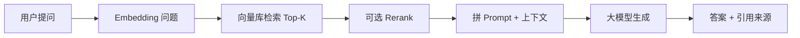

# MedRAG：LangChain + 向量库 + 大模型问答 — 学习与实施路线

> 面向当前仓库：`web/`（前端）+ `server/`（FastAPI）。  
> 产品目标见 [`prd.md`](./prd.md) §3.2～3.4；环境见 [`backend-setup.md`](./backend-setup.md)。

---

## 一、你要做成什么样（先对齐目标）

一次问答在系统里实际是这条链：



**MedRAG 的硬性要求**（实现时始终记住）：

| 规则 | 做法 |
|------|------|
| 不瞎编 | Prompt 写死：仅依据 `context` 作答 |
| 无命中要拒答 | 检索分数低于阈值 → 返回「知识库中未找到」 |
| 必须可溯源 | 每个 chunk 带 `document_id`、书名、章节、页码 |
| 检索要可过滤 | 支持「全部 / 教材 / 我的」`scope`（见 PRD） |

LangChain 负责的是中间 **B～F** 的编排；FastAPI 负责 **HTTP + 鉴权 + 调 LangChain**；库表/向量存 **PostgreSQL + pgvector**（MVP 推荐）。

---

## 二、推荐学习顺序（7 个阶段）

按顺序做，**每阶段都有验收标准**，通过再进入下一阶段。

| 阶段 | 主题 | 预计时间 | 验收 |
|------|------|----------|------|
| **0** | 环境与最小 API | 0.5 天 | `uvicorn` 跑通 `/health` |
| **1** | 单独调通大模型 | 0.5～1 天 | 脚本里能对话、能流式输出 |
| **2** | 文档加载与分块 | 1 天 | 1 个 PDF → 多条 `Document` |
| **3** | Embedding + 向量库 | 1～2 天 | 能 `similarity_search` 找回相关段 |
| **4** | RAG 链（检索 + 生成） | 1～2 天 | 命令行问一句，带引用片段 |
| **5** | 接到 FastAPI | 1 天 | `POST /api/v1/chat` 返回 JSON |
| **6** | 知识库上传与 scope | 2～3 天 | 上传 PDF → 入库 → 按范围检索 |
| **7** | 流式 SSE + 前端联调 | 1～2 天 | `web` 聊天页真实调用 |

下面每一步写清 **操作命令** 和 **建议目录**。

---

## 阶段 0：环境与项目骨架（你已基本完成）

```bash
cd server
source .venv/bin/activate
pip install fastapi "uvicorn[standard]"
uvicorn main:app --reload
```

**建议把 `server/` 目录逐步长成：**

```
server/
├── main.py              # FastAPI 入口、挂路由
├── .env                 # API Key（勿提交 Git）
├── requirements.txt
├── app/
│   ├── config.py        # 读环境变量
│   ├── chains/          # LangChain 链
│   ├── services/        # 检索、入库
│   └── api/v1/          # chat、documents 路由
└── scripts/             # 本地实验脚本（阶段 1～4 用）
    ├── 01_llm_chat.py
    ├── 02_ingest_pdf.py
    └── 03_rag_query.py
```

**本阶段验收**：访问 `http://127.0.0.1:8000/docs` 能看到 Swagger。

---

## 阶段 1：单独调通大模型（先不要向量库）

### 要学什么

- LangChain 里 **Chat Model** 抽象：`ChatOpenAI` / `ChatDeepSeek`（OpenAI 兼容接口）
- **Message** 类型：`SystemMessage`、`HumanMessage`
- **`.invoke()`** 与 **`.stream()`**

### 操作步骤

1. 申请 API Key（PRD 推荐 DeepSeek，也可用 OpenAI 兼容任意厂商）。
2. 安装依赖：

```bash
pip install langchain langchain-openai python-dotenv
```

3. 新建 `server/.env`：

```env
OPENAI_API_KEY=你的key
OPENAI_API_BASE=https://api.deepseek.com/v1
OPENAI_MODEL=deepseek-chat
```

4. 新建 `server/scripts/01_llm_chat.py`（本地实验，不经过 FastAPI）：

```python
from dotenv import load_dotenv
load_dotenv()

from langchain_openai import ChatOpenAI
from langchain_core.messages import SystemMessage, HumanMessage

llm = ChatOpenAI(model="deepseek-chat", temperature=0)

msgs = [
    SystemMessage(content="你是医学生学习助手，不替代诊疗。"),
    HumanMessage(content="用一句话解释什么是肺栓塞。"),
]
print(llm.invoke(msgs).content)
```

5. 运行：

```bash
cd server
source .venv/bin/activate
python scripts/01_llm_chat.py
```

**本阶段验收**：终端能打印模型回复；改 `HumanMessage` 内容，回复跟着变。

---

## 阶段 2：文档加载与分块（知识从哪来）

### 要学什么

- **Document Loader**：`PyMuPDFLoader` / `PDFPlumber` 读 PDF
- **Text Splitter**：`RecursiveCharacterTextSplitter`（`chunk_size`、`chunk_overlap`）
- 元数据：`metadata={"source": "内科学.pdf", "page": 12}`

### 操作步骤

```bash
pip install langchain-community pymupdf
```

`server/scripts/02_ingest_pdf.py` 思路：

1. `loader.load()` 得到每页或整本文档
2. `splitter.split_documents(docs)` 得到 chunks
3. `print(len(chunks))`，打印前 2 条的 `page_content` 和 `metadata`

**建议参数（MVP）**：

| 参数 | 建议值 |
|------|--------|
| `chunk_size` | 500～800 字（中文按字符） |
| `chunk_overlap` | 80～120 |

**本阶段验收**：指定一本 PDF，能输出 >10 条 chunk，且 `metadata` 里带页码或文件名。

---

## 阶段 3：Embedding + 向量库（能「搜到」）

### 要学什么

- **Embeddings**：`OpenAIEmbeddings` 或本地 `HuggingFaceEmbeddings(bge-m3)`
- **VectorStore**：MVP 用 **`Chroma` 本地目录** 做实验最快；上线换 **pgvector**
- **`add_documents`** 与 **`similarity_search`**

### 操作步骤（先用 Chroma 学通，再迁 pgvector）

```bash
pip install chromadb langchain-chroma
```

`server/scripts/03_build_index.py`：

1. 复用阶段 2 的 chunks
2. `vectorstore = Chroma.from_documents(chunks, embedding, persist_directory="./data/chroma")`
3. 问句：`vectorstore.similarity_search("肺栓塞的症状", k=4)`
4. 打印每条 `page_content` 前 100 字 + `metadata`

**本阶段验收**：问「肺栓塞」，返回的片段确实来自你入库的 PDF，而不是无关内容。

### 与 MedRAG 产品对齐（后期）

| 实验（现在） | 产品（阶段 6） |
|--------------|----------------|
| Chroma 本地文件夹 | PostgreSQL + pgvector |
| 手动跑脚本入库 | 上传 API + Worker 异步入库 |
| 全库检索 | 带 `user_id`、`document_id`、`scope` 过滤 |

---

## 阶段 4：RAG 链 — 检索 + 生成（核心）

### 要学什么

- **LCEL**：`chain = runnable | runnable`
- **`create_retrieval_chain`** 或自己拼：`retriever | format_docs | prompt | llm`
- **Prompt 模板**：把 `{context}` 和 `{input}` 分开
- 输出里带上 **source documents** 做引用

### 操作步骤

`server/scripts/04_rag_query.py` 最小流程：

```text
question
  → retriever.get_relevant_documents(question)   # 或 retriever.invoke
  → 若无结果或分数太低 → 直接返回「未找到」
  → format_docs(docs) → 拼进 prompt
  → llm.invoke
  → 打印 answer + 每条 doc 的 metadata（当作 citation）
```

**Prompt 要点（复制进 System）**：

```text
你只能根据以下「参考资料」回答问题。
若资料不足以回答，请明确说「知识库中未找到相关信息」，不要编造。
回答末尾用 [1][2] 标注引用，与参考资料序号对应。

参考资料：
{context}
```

**本阶段验收**：  
- 问库里有内容的问题 → 有答案 + 引用列表  
- 问库里没有的问题 → 拒答，不胡编  

---

## 阶段 5：接到 FastAPI（从脚本搬进服务）

### 要学什么

- 路由：`APIRouter(prefix="/api/v1")`
- Pydantic 请求体：`question`、`scope`、`document_ids`
- 依赖注入：启动时加载 `vectorstore` / `retriever`（或按需连接 DB）

### 操作步骤

1. `main.py` 挂载 `chat` 路由。
2. 实现 `POST /api/v1/chat`：

```json
// 请求
{ "question": "什么是肺栓塞？", "scope": "all" }

// 响应（先非流式）
{
  "answer": "...",
  "citations": [
    { "label": "《内科学》第8版 · p.128", "excerpt": "..." }
  ]
}
```

3. 把阶段 4 的逻辑抽到 `app/services/rag.py` 里的一个函数 `answer(question, scope) -> ...`。

**本阶段验收**：用 Swagger `/docs` 或 `curl` 能打到接口并拿到 `answer` + `citations`。

---

## 阶段 6：知识库管理 + 检索范围（对齐 PRD P1）

### 要做什么

| 能力 | 说明 |
|------|------|
| 系统库 | `scripts/ingest/` 批量导入教材 PDF |
| 用户上传 | `POST /api/v1/documents` → 解析 → 分块 → embedding |
| 删除 | 按 `document_id` 删向量与文件 |
| scope | 检索时 SQL/向量过滤：全部 / 仅系统 / 仅用户 |

### 学习重点

- 异步任务：Redis + Worker（解析别阻塞 API）
- 表设计：`documents`、`chunks`（PRD 里有字段说明）
- LangChain **metadata filter**：`retriever.search_kwargs = {"filter": {"document_id": {"$in": [...]}}}`

**本阶段验收**：在 `web` 知识库页上传一个 PDF，状态变为已向量化后，聊天选「仅我的」能检索到该文件内容。

---

## 阶段 7：流式输出 + 前端联调

### 要学什么

- LangChain **`llm.stream()`**
- FastAPI **`StreamingResponse`** / SSE
- Next.js 读 `EventSource` 或 `fetch` 流式 body

### 操作步骤

1. `POST /api/v1/chat/stream` 返回 `text/event-stream`
2. `web` 里把 `chat-page` 的 mock 换成真实 API（`NEXT_PUBLIC_API_BASE_URL`）
3. 侧边栏引用与流式正文同步更新

**本阶段验收**：网页提问 → 字逐段出来 → 引用侧栏有来源。

---

## 三、依赖安装一览（按阶段追加）

在 `server/requirements.txt` 里可分批写：

```text
# 阶段 0～1
fastapi
uvicorn[standard]
python-dotenv
pydantic-settings

# 阶段 1～4 LangChain
langchain>=0.3
langchain-core
langchain-openai
langchain-community
langchain-chroma

# 文档
pymupdf

# 阶段 6+ 数据库
# sqlalchemy
# asyncpg
# pgvector
# redis
# celery 或 arq
```

安装：

```bash
cd server && source .venv/bin/activate
pip install -r requirements.txt
```

---

## 四、和 PRD 功能怎么对应

| PRD 功能 | 你学的 LangChain 环节 | 阶段 |
|----------|-------------------------|------|
| AI 医学问答 | RAG 链 + LLM | 4、5、7 |
| 文献引用 | retriever 返回的 metadata | 4 |
| 知识库上传 | Loader + Splitter + VectorStore.add | 2、3、6 |
| 检索范围 | metadata filter / SQL 条件 | 6 |
| Rerank（加分） | `ContextualCompressionRetriever` 或 bge-reranker | 4 之后可选 |

---

## 五、常见坑（提前知道）

| 现象 | 原因 | 处理 |
|------|------|------|
| 回答胡编 | 没约束「仅依据 context」 | 加强 System Prompt + 无命中拒答 |
| 检索不准 | chunk 太大/太小、没 overlap | 调 `chunk_size` / `overlap` |
| 中文效果差 | Embedding 模型不合适 | 换 bge-m3 等多语模型 |
| 很慢 | 每次请求重建向量库 | 启动时加载一次 store，或常驻 DB |
| Key 泄露 | `.env` 提交到 Git | `.gitignore` 里加 `.env` |

---

## 六、本周可执行的最小计划（建议）

| 天 | 任务 |
|----|------|
| Day 1 | 阶段 1：`01_llm_chat.py` 调通 DeepSeek/OpenAI |
| Day 2 | 阶段 2～3：1 本 PDF 入库 Chroma，`similarity_search` 成功 |
| Day 3 | 阶段 4：`04_rag_query.py` 带引用、能拒答 |
| Day 4 | 阶段 5：`POST /api/v1/chat` + Swagger 测试 |
| Day 5+ | 阶段 6～7：上传、scope、SSE、接 `web` |

---

## 七、延伸阅读（官方文档）

- LangChain 概念索引：<https://python.langchain.com/docs/concepts/>
- RAG 教程：<https://python.langchain.com/docs/tutorials/rag/>
- FastAPI：<https://fastapi.tiangolo.com/>

---

## 八、下一步你可以让我帮你做什么

在对话里直接说即可，例如：

1. 生成 `server/scripts/01_llm_chat.py`～`04_rag_query.py` 完整可运行代码  
2. 把 `POST /api/v1/chat` 接到现有 `main.py`  
3. 写 `docker-compose`（Postgres + pgvector + Redis）  

---

*文档版本：v0.1 · 与 `server/main.py` 及 PRD v1.1 对齐*
