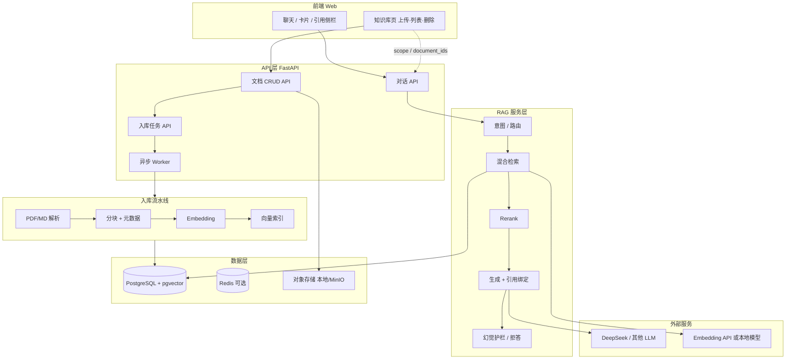

# MedRAG — 医学生智能知识助手

> 基于医学知识库的 RAG 学习助手：可溯源问答、知识卡片与学习模式。

---

## 0. 为什么做这个方向

| 医学知识特点 | 对系统的要求 | RAG 的价值 |
|-------------|-------------|-----------|
| 文档多、结构复杂 | 需要检索 + 引用 | 答案可追溯到教材/指南 |
| 更新频繁 | 知识库可增量更新 | 不依赖模型「记忆」 |
| 专业术语重 | 领域 Embedding / 词典 | 语义召回更准 |
| **幻觉容忍度低** | 必须带来源 | 比纯 Chat 更适合医学场景 |

**产品边界（重要）**：不做「普通 AI 聊天」，不做真实诊疗决策；定位为 **医学生学习与知识检索助手**，规避医疗合规风险，同时 Demo 与数据都更容易落地。

---

## 一、产品定位

| 项 | 内容 |
|----|------|
| 名称 | **MedRAG** — 医学生智能知识助手 |
| 一句话 | 基于权威医学资料的 **可溯源 AI 问答 + 结构化学习辅助** |
| 核心能力 | 医学问答（带引用）· **个人知识库（上传/删除）** · 知识卡片 · 学习模式 ·（后期）知识图谱 |
| 差异化 | 每条结论可点击溯源；支持导入自有讲义/笔记，问答范围可勾选 |

---

## 二、目标用户与阶段

### 2.1 第一阶段（MVP 聚焦）

**医学生** — 理由：公开教材/指南多、不涉及诊疗、风险可控、适合作品集 Demo。

### 2.2 后续扩展（路线图，不纳入 MVP）

护士 · 规培医生 · 执业医师考试 · 临床检索 · 医院内部知识库（需授权与合规评审）。

---

## 三、功能设计

### 3.1 功能全景与优先级

| 优先级 | 功能 | 说明 | 阶段 |
|--------|------|------|------|
| P0 | **AI 医学问答 + 引用** | 检索 → 生成 → 附来源片段/页码 | MVP |
| P0 | **文献/教材溯源** | 答案中标注《内科学》章节、指南条目等 | MVP |
| P1 | **知识库管理（上传 / 删除）** | 用户上传 PDF/MD，列表查看、删除文档及向量 | MVP |
| P1 | **检索范围选择** | 全库 / 仅系统库 / 仅我的上传 / 勾选指定文档 | MVP |
| P1 | **医学知识卡片** | 定义 / 病因 / 症状 / 诊断 / 治疗 / 鉴别 / 口诀 | v1.1 |
| P1 | **对话历史与收藏** | 复习、导出笔记 | v1.1 |
| P2 | **AI 学习模式** | 自动出题、重点总结、Anki 导出 | v1.2 |
| P3 | **医学知识图谱** | 疾病 → 症状 → 检查 → 药物 | v2（面试加分项） |

### 3.2 P0：AI 医学问答（核心）

**用户**：什么是肺栓塞？

**系统流程**：

1. 意图识别（疾病概念 / 鉴别 / 治疗等，影响 Prompt 模板）
2. 混合检索（向量 + 可选关键词/BM25）
3. Rerank 取 Top-K 片段
4. LLM 在「仅依据上下文」约束下生成答案
5. 返回：**正文 + 引用列表**（书名、章节、页码、原文片段）

**输出示例**：

> 根据《内科学》第八版，第 × 章：肺栓塞是由于内源性或外源性栓子堵塞肺动脉…
> **引用**：[1] 内科学 8 版 · 第 3 章 · p.128

### 3.3 P0：文献引用（必须有）

医疗场景 **宁可少答，不可瞎编**。硬性规则：

- 无检索命中 → 明确回复「知识库中未找到」，不编造
- 每个关键论断至少对应 1 条 `chunk_id`
- UI 展示可展开的原文片段与来源元数据

**知识来源类型（分期纳入）**：

| 阶段 | 来源 |
|------|------|
| MVP | 教材 PDF（内科学、病理学等）、教学讲义 |
| v1.1 | 临床指南摘要、WHO 公开文档 |
| v2 | PubMed 摘要（API，需注意版权与摘要长度） |

### 3.4 P1：知识库管理（上传 / 删除）

知识库分 **两层**，检索时可组合使用：

| 类型 | 说明 | 谁维护 | MVP |
|------|------|--------|-----|
| **系统知识库** | 预置教材、指南（脚本批量入库） | 运营/开发者 | ✅ |
| **用户知识库** | 用户自行上传的学习资料 | 用户本人 | ✅ |

#### 上传

**支持格式**：PDF、Markdown（可选扩展：DOCX、TXT）

**用户操作**：

1. 在「知识库」页拖拽或选择文件上传
2. 填写展示名（默认取文件名）、可选标签（如「期末」「呼吸科」）
3. 后台异步：解析 → 分块 → Embedding → 入库
4. 列表展示状态：`排队中` / `解析中` / `已向量化` / `失败`（可重试）

**限制（MVP）**：

| 项 | 建议值 |
|----|--------|
| 单文件大小 | ≤ 50 MB |
| 用户总容量 | ≤ 500 MB（可配置） |
| 并发入库任务 | 每用户 1 个，其余排队 |

#### 删除

**用户操作**：在文档列表点击删除 → 二次确认

**系统行为（级联删除）**：

1. 标记 `documents.status = deleted`（软删，便于审计；也可配置硬删）
2. 删除该文档下全部 `chunks` 及 pgvector 中的 embedding
3. 删除对象存储中的原始文件与解析缓存
4. 删除后：**检索不再命中**；历史对话中的旧 `citation` 保留展示但标注「来源已删除」

**不支持 MVP**：在线编辑文档内容（仅支持删后重新上传）。

#### 列表与详情

- 列表：文件名、大小、页数/chunk 数、上传时间、状态、操作（删除 / 重新索引）
- 详情：分块预览（前 N 条）、失败原因日志

#### 检索范围（与问答联动）

聊天页可选：

- **全部**：系统库 + 当前用户上传库
- **仅系统教材**
- **仅我的资料**
- **自定义**：勾选若干 `document_id`

未选时默认「全部」。检索 API 必须带 `scope` / `document_ids` 过滤，避免串库。

### 3.5 P1：医学知识卡片

用户提问后，除流式回答外，侧边栏生成结构化卡片：

- 疾病定义 · 病因 · 症状 · 诊断 · 治疗 · 鉴别诊断 · 记忆口诀
- 字段均带来源标注；无依据的字段标为「待补充」

### 3.6 P2：AI 学习模式

在问答基础上一键生成：

- 选择题（含解析与出处）
- 本章重点 bullet
- Anki 格式导出（`.apkg` 或 CSV）
- （可选）Mermaid 思维导图

### 3.7 P3：医学知识图谱（高级）

实体关系示例：`疾病 --[表现为]--> 症状 --[需检查]--> 检验 --[治疗]--> 药物`

- MVP 可不建图库，用 **结构化 JSON + 前端关系图** 做轻量 Demo
- v2 再引入 Neo4j / 图数据库与 NER+关系抽取流水线

---

## 四、系统架构

### 4.1 逻辑架构



### 4.2 请求链路（问答）

```
用户问题
  → Query 改写（可选，多轮指代消解）
  → Embedding(query)
  → 向量检索 Top-20 + BM25 Top-10（可选）
  → Rerank → Top-5 chunks
  → Prompt（系统约束 + chunks + 用户问题）
  → LLM 流式输出
  → 后处理：解析 citation 标记，校验 chunk_id 合法性
  → 返回 { answer, citations[], cards? }
```

### 4.3 知识库 API（概要）

| 方法 | 路径 | 说明 |
|------|------|------|
| POST | `/api/v1/documents` | 上传文件（multipart），创建记录并入队 |
| GET | `/api/v1/documents` | 当前用户文档列表（分页、按状态筛选） |
| GET | `/api/v1/documents/{id}` | 详情 + chunk 统计 / 失败原因 |
| DELETE | `/api/v1/documents/{id}` | 删除文档并级联清理向量与文件 |
| POST | `/api/v1/documents/{id}/reindex` | 重新解析入库（同文件覆盖上传场景） |
| GET | `/api/v1/documents/{id}/chunks` | 分块预览（管理用，分页） |

入库与删除走 **异步任务**（Redis + Worker）；前端轮询或 SSE 推送 `status` 变更。

### 4.4 部署架构（MVP 推荐）

```
┌─────────────────────────────────────────┐
│  Docker Compose（单机即可跑通 Demo）      │
│  ├─ web      (Next.js / Vite 静态)       │
│  ├─ api      (FastAPI + uvicorn)         │
│  ├─ postgres (pgvector)                  │
│  ├─ redis    (上传解析 / 删除清理 任务队列) │
│  └─ worker   (PDF 解析、embedding，可选)    │
└─────────────────────────────────────────┘
```

**说明**：用户上传/删除依赖 Worker，MVP 建议 **Redis 队列 + 独立 worker 进程**（Celery / ARQ），避免阻塞 API（参考 `doc/ele.md` 异步解析思路）。

---

## 五、技术选型

### 5.1 选型原则

1. **MVP 优先能跑通**：少组件、少运维，作品集可本地一键启动
2. **与岗位 JD 对齐**：Python、RAG、向量库、Agent 编排、可观测链路
3. **可演进**：MVP 不锁死，向量库与 LLM 通过抽象层可替换

### 5.2 推荐技术栈（默认方案）

| 层级 | 选型 | 理由 |
|------|------|------|
| **前端** | **Next.js 14+ (App Router) + React + TypeScript + Tailwind** | SSR/路由成熟；聊天 UI、流式 SSE 生态好；面试常见 |
| **状态** | Zustand + TanStack Query | 轻量；服务端状态与缓存清晰 |
| **API** | **Python 3.11+ FastAPI** | RAG/ML 生态最好；与 JD 中 Python 要求一致 |
| **RAG 框架** | **LangChain（Python）** 或 **LlamaIndex** 二选一 | LangChain 资料多；LlamaIndex 检索抽象更省心。建议 **LangChain**，便于展示 Agent/Tool 扩展 |
| **LLM** | **DeepSeek API**（主）+ 备用 OpenAI 兼容接口 | 成本低、中文医学表述尚可；抽象 `LLMProvider` 便于切换 |
| **Embedding** | **BAAI/bge-m3**（本地 Ollama/TEI）或 **智谱 / 通义 embedding API** | 中文医学术语友好；MVP 可用 API 省 GPU |
| **Rerank** | **bge-reranker-base**（本地）或 Cohere Rerank API | 明显提升引用准确率，建议 v1.0 即接入 |
| **向量存储** | **PostgreSQL + pgvector**（MVP） | 一套库搞定业务表 + 向量；Docker 简单 |
| **向量存储（扩展）** | Milvus / Qdrant | 文档量大（>100 万 chunk）或要混合检索时再迁 |
| **关系库** | PostgreSQL | 用户、会话、文档、chunk 元数据 |
| **缓存/队列** | Redis + Celery（或 ARQ） | 异步解析 PDF、批量 embedding |
| **对象存储** | 本地目录 / MinIO | 原始 PDF、解析后的 Markdown |
| **文档解析** | PyMuPDF / pdfplumber + Unstructured（可选） | 提取文本与页码；表格多的章节可后期加 OCR |
| **可观测** | Langfuse 或 LangSmith（二选一） | 记录 trace、prompt、检索命中，面试可讲「全链路优化」 |

> **关于 PRD 初稿中的 Milvus**：适合生产与大规模式模，但 MVP 运维成本高。建议 **先用 pgvector 完成闭环**，README/面试中说明「可平滑迁移至 Milvus」即可。
> **关于 Node.js**：若团队只熟 TS，可用 Nest.js + LangChain.js，但 **医学 PDF 解析与 Rerank 仍建议 Python 微服务**，主 API 用 Python 更省事。

### 5.3 与本地 Electron 方案的关系（`doc/ele.md`）

| 维度 | MedRAG（本项目） | AI Knowledge Studio（参考） |
|------|------------------|------------------------------|
| 定位 | 领域垂直：医学学习 | 通用：本地文件知识工作台 |
| 部署 | Web + 服务端（可 Docker） | Electron 本地优先 |
| 向量库 | pgvector → 可迁 Milvus | SQLite 本地向量 |
| 可复用思路 | 增量索引（hash+chunk diff）、溯源高亮、Worker 异步解析 | 直接借鉴到入库流水线设计 |

**建议**：MedRAG MVP 做 **Web 版** 便于分享 Demo；若需「数据不出本机」叙事，再 fork 一个 Electron 壳接同一套 API。

### 5.4 不建议 MVP 阶段引入的

- 多 Agent 复杂编排（MetaGPT 式）— 先用 **单 Agent + RAG Tool** 即可
- 自训练医学大模型
- 完整知识图谱 + 图数据库
- Milvus 集群 + K8s（除非目标就是 infra 展示）

---

## 六、知识库设计（核心）

### 6.1 双层知识库模型

```
┌─────────────────────────────────────────────────────────┐
│                      检索范围（scope）                    │
│   all │ system_only │ user_only │ document_ids[]        │
└──────────────────────────┬──────────────────────────────┘
                           ▼
        ┌──────────────────┴──────────────────┐
        ▼                                      ▼
  系统知识库 (owner=system)            用户知识库 (owner=user_id)
  脚本/运营批量入库                    用户 Web 上传 / 删除
        │                                      │
        └──────────────┬───────────────────────┘
                       ▼
              documents → chunks → vectors
                       ▼
                 Citation 溯源
```

### 6.2 数据流

```
知识源（PDF / MD / 指南 HTML）
    ↓ 上传 API 或 脚本入库
Document（文档表，含 owner_type / user_id）
    ↓ 异步任务：解析（保留 书名 / 章节 / 页码）
    ↓ 分块策略（按标题层级 + 固定 token 上限 + overlap）
Chunk（块表 + 原文 + 元数据）
    ↓ Embedding
Vector（pgvector）
    ↓ 检索时按 scope 过滤 document_id
Citation（展示给用户，标注「系统」或「我的资料」）
```

**删除数据流**：

```
DELETE /documents/{id}
    → 校验归属（仅本人或管理员）
    → 取消进行中的 ingest 任务
    → 事务：删 chunks（含 vector）→ 更新 document.status=deleted
    → 异步删 OSS 文件
```

### 6.3 分块策略（医学向）

| 参数 | 建议值 | 说明 |
|------|--------|------|
| chunk_size | 512–800 tokens | 单块容纳一个完整小节为宜 |
| overlap | 80–120 tokens | 避免概念被截断 |
| 分隔符 | 按「章 / 节 / 小节」标题切 | 优于纯字符长度切分 |
| 元数据 | `book`, `edition`, `chapter`, `section`, `page_start`, `page_end` | 引用展示依赖 |

### 6.4 入库清单（MVP 最小数据集）

- 《内科学》《病理学》《诊断学》等 **1–2 本** 核心教材 PDF（自备正版或试读章节）
- 1 份公开 **临床指南** PDF（如某病种诊疗指南）
- 可选：自编 Markdown 讲义若干篇

目标 chunk 数：**3,000–10,000** 即可演示检索质量。

**用户库**：不预置数据；Demo 时引导用户上传 1 份讲义 PDF 或课程 MD，验证「上传 → 问答引用自己的资料」闭环。

### 6.5 增量更新与覆盖

- 文件级 `content_hash` → 变更才重新解析
- Chunk 级 hash → 仅对变更块重新 embedding（对齐 ele 项目思路）
- **同标题重新上传**：视为新 `document_id`，或调用 `reindex` 覆盖旧文档（先删旧 chunks 再入库）

---

## 七、数据库设计（核心）

### 7.1 ER 概要

```
users ──< documents (user 上传; owner_type=system 无 user_id)
users ──< chat_sessions ──< chat_messages
documents ──< chunks ── embedding 存于 chunks 表
chunks ──< citations (message_id 关联)
ingest_jobs (document_id, status, error)  # 可选独立任务表
study_cards (message_id, structured_json)
quiz_items (message_id, optional)
```

### 7.2 核心表（逻辑）

**documents**

| 字段 | 类型 | 说明 |
|------|------|------|
| id | uuid | PK |
| user_id | uuid nullable | 系统库为 NULL；用户上传必填 |
| owner_type | enum | `system` / `user` |
| title | text | 展示名 |
| original_filename | text | 上传原始文件名 |
| source_type | enum | textbook / guideline / lecture / user_upload |
| mime_type | text | application/pdf 等 |
| file_size | bigint | 字节 |
| file_path | text | 对象存储路径 |
| content_hash | text | 增量更新 / 去重 |
| chunk_count | int | 冗余统计，列表展示 |
| status | enum | `queued` / `parsing` / `embedding` / `ready` / `failed` / `deleted` |
| error_message | text nullable | 失败原因 |
| tags | jsonb | 用户标签，可选 |
| created_at / updated_at / deleted_at | timestamptz | 软删时间 |

**chunks**

| 字段 | 类型 | 说明 |
|------|------|------|
| id | uuid | PK |
| document_id | uuid | FK |
| content | text | 块正文 |
| token_count | int | |
| metadata | jsonb | chapter, page, section… |
| embedding | vector(1024) | 维度随模型调整 |

**chat_messages**

| 字段 | 类型 | 说明 |
|------|------|------|
| id | uuid | PK |
| session_id | uuid | FK |
| role | enum | user / assistant |
| content | text | |
| citations | jsonb | [{ chunk_id, excerpt, source_label }] |
| retrieval_debug | jsonb | 可选，面试演示检索过程 |

**study_cards**（P1）

| 字段 | 类型 | 说明 |
|------|------|------|
| message_id | uuid | 关联回答 |
| fields | jsonb | 定义、病因…各带 source |

**ingest_jobs**（可选，任务与文档解耦）

| 字段 | 类型 | 说明 |
|------|------|------|
| id | uuid | PK |
| document_id | uuid | FK |
| job_type | enum | ingest / delete / reindex |
| status | enum | pending / running / done / failed |
| progress | int | 0–100 |
| error_message | text | |

### 7.3 索引与隔离

- `chunks.embedding` → IVFFlat 或 HNSW（pgvector）
- `chunks(document_id)`、`documents(user_id, status)`、`chat_messages(session_id)`
- 全文：PostgreSQL `tsvector` on `chunks.content`（混合检索）
- **检索 SQL 必带**：`documents.status = 'ready'` 且 `deleted_at IS NULL`；按 `owner_type` / `user_id` / `document_ids` 过滤

---

## 八、知识图谱设计（P3 / 高级）

### 8.1 模型

```
节点类型: Disease | Symptom | Exam | Drug | Mechanism
边类型:   HAS_SYMPTOM | DIAGNOSED_BY | TREATED_WITH | DIFFERENTIAL
```

### 8.2 构建路径

1. **轻量（Demo）**：LLM 从检索结果抽取三元组 → JSON → 前端 vis-network / Cytoscape
2. **重量（v2）**：NER + 关系抽取 → Neo4j；与 RAG 共用 chunk 出处

### 8.3 与 RAG 协同

- 问答仍走 RAG（可信）
- 图谱用于 **可视化浏览** 与 **关联推荐**，不单独作为生成唯一依据

---

## 九、非功能需求

| 类别 | 目标 |
|------|------|
| 延迟 | 首 token < 3s（流式）；检索 < 500ms |
| 可用性 | 知识库为空时优雅降级 |
| 安全 | API Key 仅服务端；上传白名单（pdf/md）；用户只能删自己的文档；系统库仅管理员写入 |
| 隐私 | 用户文档按 `user_id` 隔离存储路径；删除后 30 天内可配置物理清除 |
| 合规 | 全局免责声明：「仅供学习，不能替代诊疗」 |
| 评估 | 自建 50–100 条医学 QA；指标：引用准确率、拒答率、幻觉率（人工抽检） |

---

## 十、项目分期与里程碑

### Phase 0 — 基础闭环（2–3 周）

- [ ] Monorepo 或双仓库：`web` + `api`
- [ ] Docker Compose：Postgres(pgvector) + API
- [ ] PDF 入库脚本 → 检索 API
- [ ] 单轮问答 + 引用展示（无登录可先固定 user）

### Phase 1 — MVP 可演示（+2 周）

- [ ] 聊天 UI（流式 + 引用侧栏 + **检索范围选择**）
- [ ] **知识库页**：上传、列表、删除、状态轮询
- [ ] 文档 API + Worker 异步入库 / 级联删除
- [ ] 多轮对话（带 history 压缩）
- [ ] 知识卡片结构化输出
- [ ] Langfuse 链路追踪 + README 架构图

### Phase 2 — 学习模式（+2 周）

- [ ] 出题 + Anki 导出
- [ ] 文档 reindex、分块预览、标签筛选

### Phase 3 — 加分项

- [ ] 知识图谱可视化
- [ ] Rerank + 混合检索调优报告
- [ ]（可选）Electron 本地版

---

## 十一、仓库结构建议

```
my-rag/
├── apps/
│   ├── web/                 # Next.js：聊天 + 知识库管理页
│   ├── api/                 # python FastAPI：对话 + 文档 CRUD
│   └── worker/              # 入库 / 删除清理（可选独立进程）
├── packages/
│   └── shared/              # 类型、常量（可选）
├── scripts/
│   └── ingest/              # 批量入库 CLI
├── docker/
│   └── docker-compose.yml
├── doc/
│   ├── prd.md               # 本文档
│   ├── architecture.md      # 可拆详细设计
│   └── eval/                # 评测集
└── README.md
```

---

## 十二、面试 / 作品集叙事要点

1. **为什么 RAG 而不是微调**：医学重溯源、教材可更新、成本低
2. **如何控制幻觉**：仅依据 context、无命中拒答、citation 校验、Rerank
3. **全链路可观测**：Langfuse 展示一次问题的检索片段与 prompt
4. **可扩展性**：pgvector → Milvus；单 Agent → Plan-and-Execute 学习任务
5. **与 JD 对齐**：Python、向量库、RAG、Prompt、异步任务、Agent Tool 调用

---

## 附录 A：Prompt 约束要点（实现时参考）

- 系统角色：医学生学习助手，非执业医师
- 仅使用提供的 `context` 作答；无依据写「未在资料中找到」
- 输出格式：Markdown + 文末 `[n]` 引用编号
- 禁止：诊断具体患者、推荐处方药剂量（可讲机制与分类）

## 附录 B：技术选型速查

| 组件 | MVP 首选 | 扩展备选 |
|------|----------|----------|
| 前端 | Next.js + TS | Electron 壳 |
| API | FastAPI | — |
| RAG | LangChain | LlamaIndex |
| LLM | DeepSeek | GPT-4o / 通义 |
| Embedding | bge-m3 | OpenAI embedding |
| 向量库 | pgvector | Milvus / Qdrant |
| 图库 | JSON + 前端图 | Neo4j |
| 观测 | Langfuse | LangSmith |

---

*文档版本：v1.1 · 新增用户知识库：上传、删除、检索范围与 API/库表设计。*
